# Task 1: 3D Printing
## 3D Printing Overview

3D printing is a process where a physical object is created from a digital design by building it layer by layer.  
The model is first designed or downloaded as an **STL file**, then processed using slicing software, which converts it into instructions for the printer. The printer follows these instructions to produce the final object.

## PLA Settings
PLA is one of the most commonly used filaments due to its ease of use and reliability. Conditions for effective printing:
- **Nozzle Temperature:** 190–220°C  
- **Bed Temperature:** 50–70°C  
- **Print Speed:** 40–60 mm/s  
- **Infill Density:** 10–25%  
- **Cooling Fan:** Improves layer quality and prevents deformation    

This task helped in understanding the basics of 3D printing, including taking an STL file and slicing it hence converting designs into physical objects.

# TASK 2: API

An API is a set of rules that allows different software applications to communicate with each other and exchange data.

***Working of an API :***

* A user sends a request to the API through an application.

* The API sends this request to a server.

* The server processes the request and sends back a response containing the required data.
* The application then displays the information to the user.  

Hence an API is compared to a waiter.

In this task, I created a stock dashboard using a stock market API. The application sends requests to the API to retrieve real-time stock data.
When users enter a stock symbol, the API returns information such as current price, market trends.  

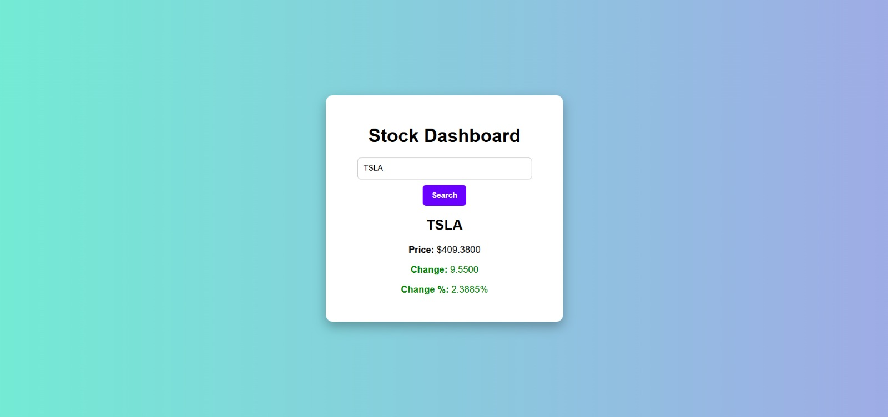

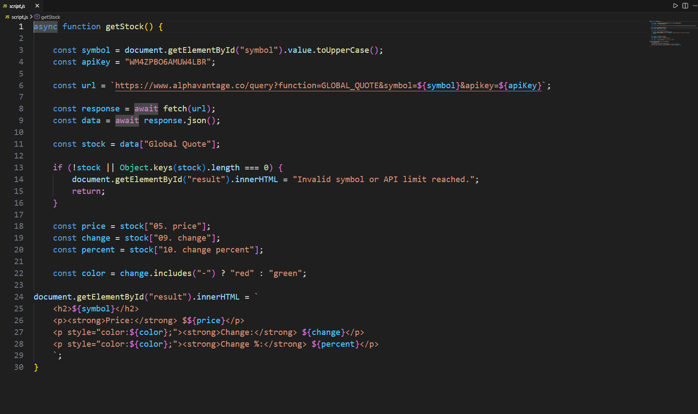

# Task 3: Working with GitHub

I started off with understanding the basics of Github like as to what is add , commit , fork , pulling request etc.  
Then I thoroughly explored the problem in the given repo and understanding the error in the add function logic in Python and fixing the bug and then proceeded to commit and pull a request.
This task has taught me a lot about Git and GitHub and has encouraged me to explore more and just to be curious to learn.  

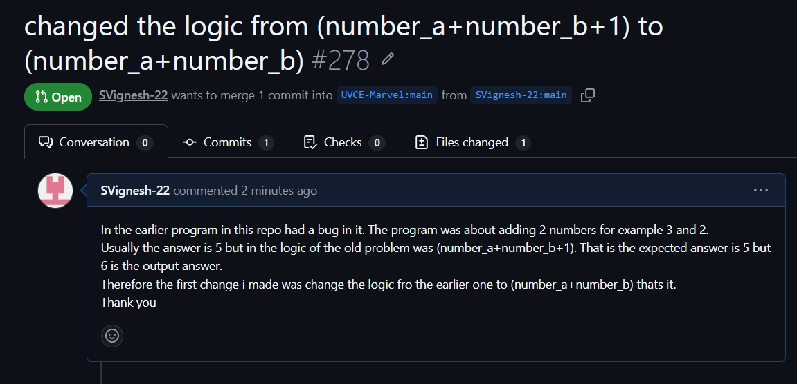

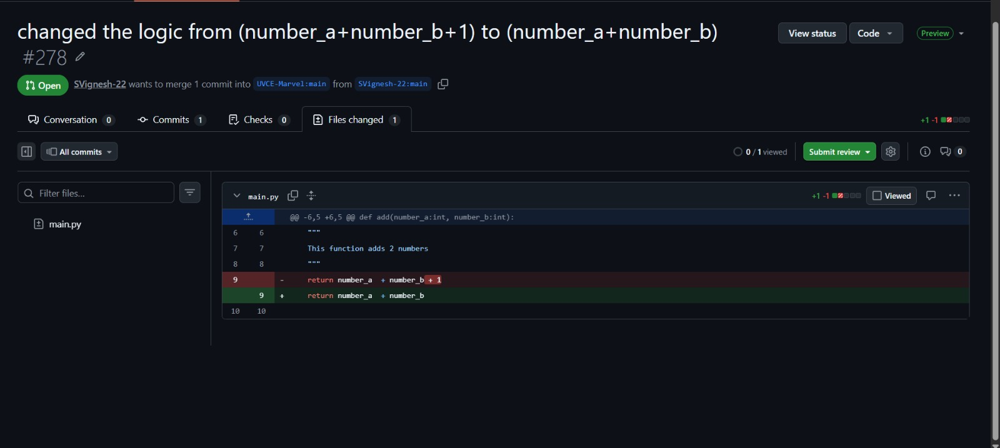  

# Task 4: Familiarizing with the Ubuntu Command Line
I used an online Ubuntu platform  so I began using it for the task. I explored the Ubuntu interface and focused mainly on working with the **terminal**. Since Linux commands were new to me, I practiced basic commands to understand file handling and navigation.  
I initially created a folder named test and created 2600 folders inside the directory and also concantenate 2 text files and displayed output.

## Commands Used
| Task | Command |
|-----|-----|
| Create folder | `mkdir test` |
| Change directory | `cd test` |
| Create blank file | `touch file1.txt` |
| Create 2600 folders | `for i in {1..2600}; do mkdir M$i; done` |
| Concatenate files | `cat file1.txt file2.txt` |
| Print working directory | `pwd` |
| List directory contents | `ls` |
| Print text | `echo "text"` |

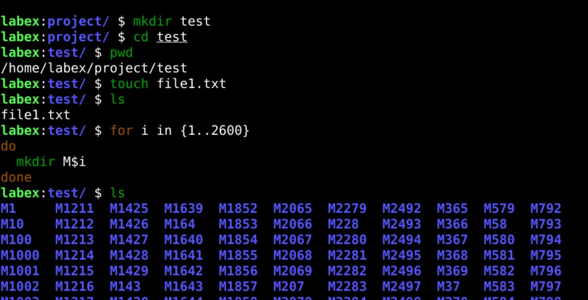
This task helped me understand the basics of the Ubuntu terminal and use common Linux commands for file and directory operations.

# Task 6: The Matrix Puzzle — Decode with NumPy & Reveal the Image
In this task, I worked with a scrambled matrix that represented the pixel values of an image. The main objective was to analyze the given matrix and use **NumPy** to rearrange the data so that the hidden image could be reconstructed.
These operations helped in restoring the the image data. 
By carefully adjusting the matrix structure, the scrambled data gradually formed a meaningful pattern.  
After reconstructing the matrix, **Matplotlib** was used to visualize the processed data. The matrix was displayed as an image(smiley face).

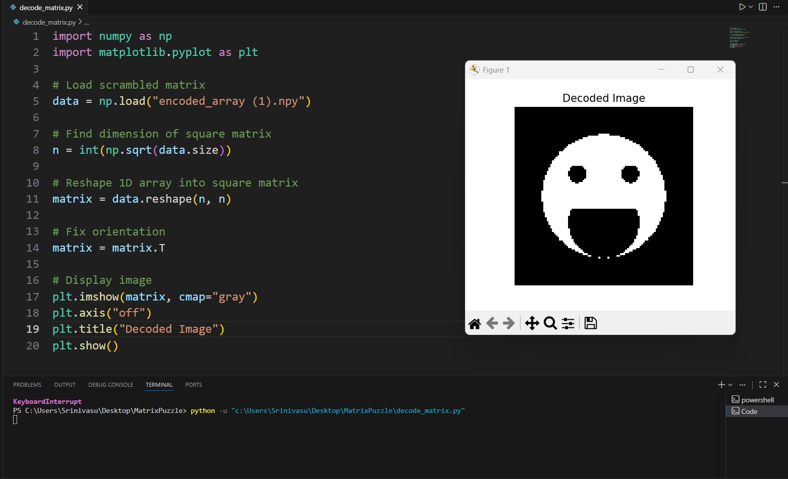

# TASK 7: Create a Portfolio Webpage
In this task, I learnt some concepts about javascript,html and css while creating the portfolio.  
I created a potfolio website to present my progress,achivements and also my contact details not only to the recriuters but to also to inspire me to get better everyday.

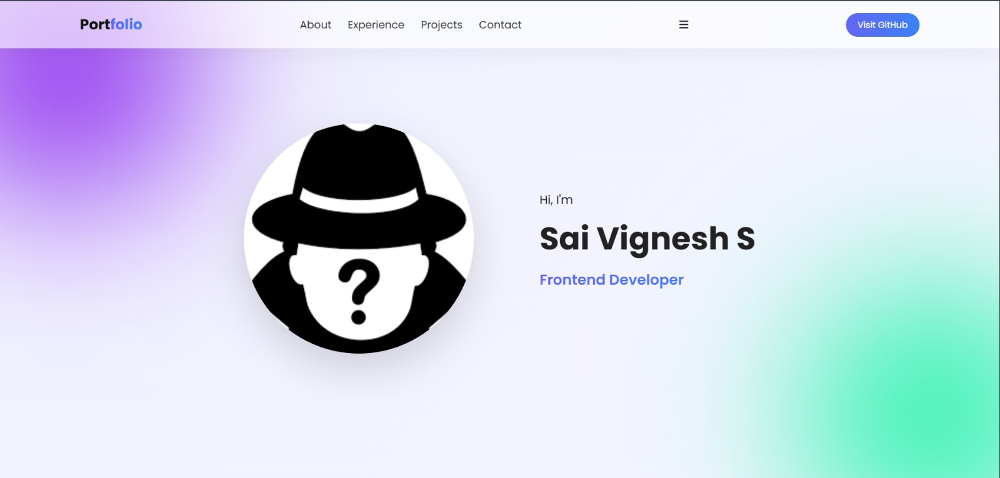

# Task 8: Writing Resource Article using Markdown
In this task, I worked on creating an article on ***How does Encryption Work In Telegram ?*** using Markdown, where I learned how to format text using simple syntax like headings, lists, and links without relying on complex tools or HTML. Through this task, I understood how Markdown makes writing clean, structured content easy and consistent across different platforms.  
The linked article is posted below :  
[Article](Telgram.md)

# Task 9: TinkerCAD
TinkerCad is a very good platform to not only design 3d models but also to simulate the circuits before proceeding to the actual physical components and circuits.  
To know more about the basics of TinkerCad I took reference from a few youtube videos as well.Meanwhile I also completed the task of building circuit for the radar system involving electromagnetic sensor.  

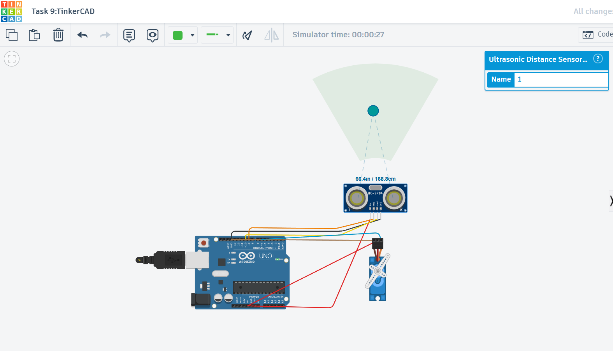

# Task 10: Speed Control of DC Motor
I controlled the speed of a DC motor using an Arduino UNO and an L298N motor driver.  
I intially simulated this circuit and its working in TinkerCad and then built the circuit using actual physical components and connections.The Arduino UNO and L293N motor driver to control the speed of a DC BO motor.
A potentiometer is used to vary the speed by sending a value to the Arduino. The Arduino sends PWM signals to the ENA pin of the L293N. The L293N then supplies power to the motor, allowing its speed to change based on the PWM signal.

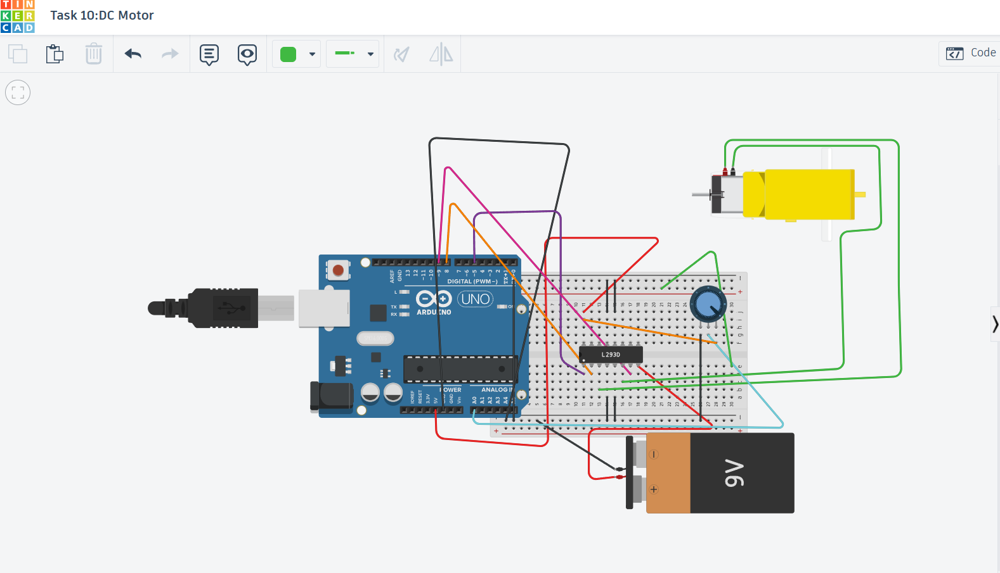

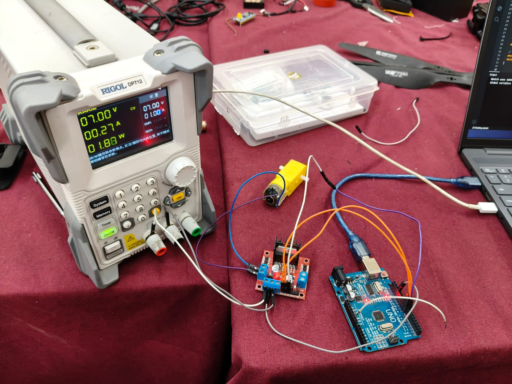

# Task 11: LED Toggle Using ESP32
In this task I learnt how to build an web server using the ESP32 microcontroller.After wiring the circuit and uploading the code via the Arduino IDE into the ESP32, it generated an IP address.  
On entering that IP address into a web browser gave me access to a server where I had the control of both the LEDs wirelessly.

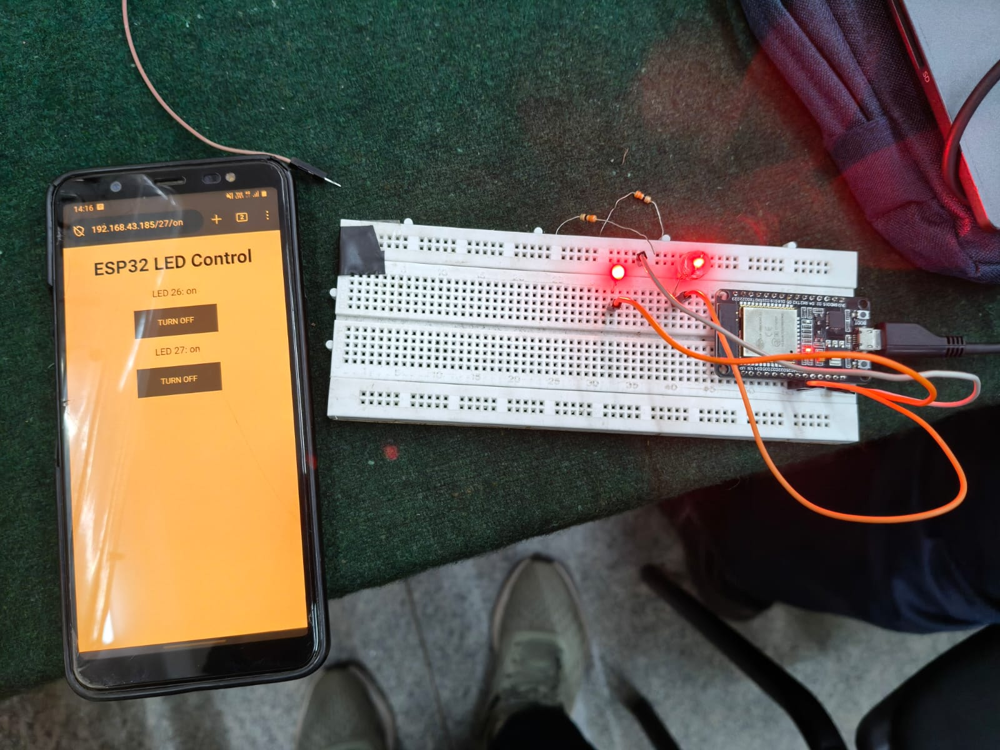

# Task 12: Soldering Prerequisites
In this task, I learnt about the soldering equipment in our lab like soldering iron, solder wire(made of 60% Tin and 40% Lead), and flux and I also practiced a few basic soldering on the soldering board which was held by the third hand support while taking all the safety precautions.

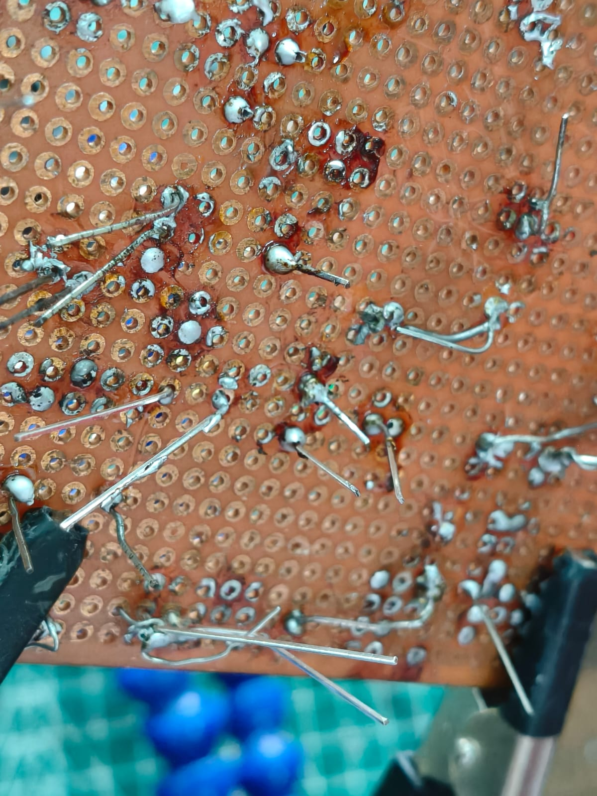

# Task 15 :Active Participation
I participated and won the 1st place in the poster presentation in the Kagada 2025 event and also participated in various events in the Impetus 2026 organised by IEEE UVCE.  
I have also attended the Google Cloud Skills Boost course and gained 19 skill badges.  
[Google Cloud Skills Boost](https://www.skills.google/public_profiles/a98d3c5d-b309-4e85-8d12-e1dce65d66c0)

# Task 17:Introduction to VR
For this task, I explored and deep dived into the info of **Virtual Reality** (VR) and also **Augmented Reality** (AR) figuring out its definition, difference, significance, current trends, scope and also about some of the Indian Companies working in this sector.
Here is my Report:  
[Report](https://github.com/SVignesh-22/task17_marvel.git)

# Task 18:Sad servers - "Like LeetCode for Linux"
In this task, I explored Sad Servers, which is like LeetCode but for Linux troubleshooting.  
The challenge, Command Line Murders, involved figuring out the murderer. It felt like solving a mystery, where each command gave a new clue. I enjoyed the process because it tested my command-line skills and made me think logically while debugging.  
It was a fun and practical way to improve my knowledge on Linux Commands.

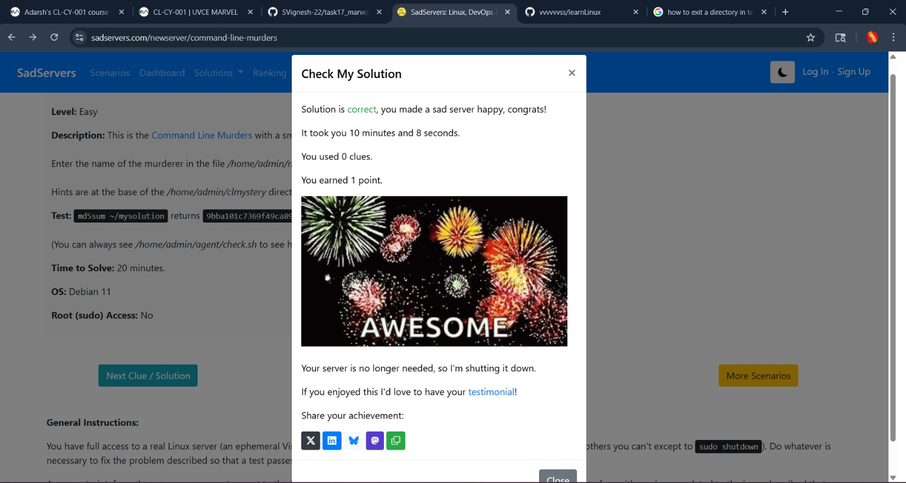

# Task 19:Make a Web app
I built a simple web app using Express.js where users can browse different resources like articles and books.I also added basic account features so users can manage their profiles like sign up and login.   
Overall, this task helped me understand how backend works with Express and how to structure a basic web app.

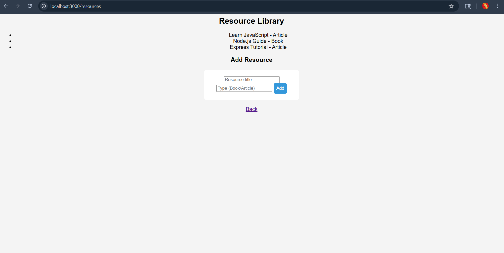
